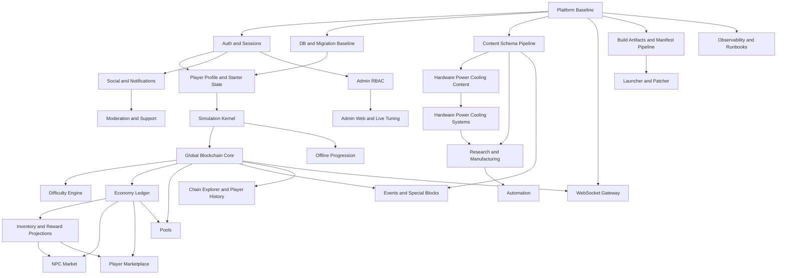

# Global Mining Network Implementation Plan v1

Source alignment:
- docs/global-mining-network-official-specification.md
- docs/game-design-brief-v1.md
- docs/master-build-plan-v1.md

Status: Execution-ready planning baseline  
Date: 2026-08-15  
Scope: Pre-coding implementation plan for product, platform, backend, client, LiveOps, launcher, and support systems

---

## 1. Purpose and Implementation Principles

Global Mining Network must be implemented as a persistent multiplayer simulation in which all players contribute to one shared fictional global blockchain. The implementation plan exists to convert the approved design direction into an ordered, testable, and ownership-clear build sequence that can start immediately without introducing rewrite traps.

Implementation principles:
- Preserve one logical global chain at all times.
- Keep the server authoritative for balances, rewards, progression, block state, settlement, and all meaningful outcomes.
- Use time-based reconstruction from state changes plus elapsed time rather than per-player per-second simulation.
- Treat the blockchain as fictional game simulation only, never real cryptocurrency, real mining, or real tokenization.
- Prefer a modular monolith first, with strict domain boundaries and queue-backed asynchronous work.
- Make all progression, hardware, research, facility, event, and reward systems data-driven.
- Use immutable or append-only records for ledgers, major event history, and critical chain history.
- Design for replayability, idempotency, and deterministic settlement from day one.
- Build the MVP vertical slice on the same architecture that will support beta, launch, and LiveOps.

Implementation guardrails:
- No client-owned formulas for rewards, progression, balances, or block completion.
- No duplicate active blocks, duplicate reward grants, duplicate ledger effects, or split active chain heads.
- No feature work that requires re-architecting chain ownership, authority, or simulation timing later.
- No launcher/update flow that assumes manual patching or developer intervention.

---

## 2. Implementation Readiness Verdict

**Verdict: Ready to begin M0 foundations and M1 simulation vertical slice implementation.**

What is ready:
- Core product direction is explicit.
- Architecture constraints are explicit.
- Technology choices are explicit enough to build the baseline stack.
- Major subsystem order is defined.
- Product surfaces beyond gameplay are already in scope, including launcher, patching, admin, moderation, and support.

What is not fully specified but does not block M0 or M1:
- Final balancing tables for hardware, research, and economy values.
- Final pool reward model choice.
- Final offline cap values.
- Final event cadence.
- Final launch-only moderation SLA targets.

Required clarifications before later phases, not before M0:
- Launch-default pool reward policy.
- Initial economy sinks and fees.
- Offline progression cap policy by player state.
- Event calendar policy and special block cadence.
- Precise installer branding, account legal copy, and telemetry consent language.

Readiness conclusion:
- M0 can start immediately.
- M1 can start as soon as M0 establishes repo, environment, auth skeleton, canonical event contracts, and database baseline.
- M2 and beyond should not start until M1 proves the one-chain, time-based, server-authoritative core in a playable slice.

---

## 3. Workstream Map

| Workstream | Objective | Primary Owners | Earliest Start | Depends On |
|---|---|---|---|---|
| Architecture and Program Control | Guard domain boundaries, sequencing, and non-negotiables | Tech Lead | M0 | None |
| Platform and Developer Experience | Repo, CI, environments, build/release, observability foundations | Platform | M0 | None |
| Identity and Account Systems | Auth, sessions, recovery, device management | Backend B | M0 | Platform baseline |
| Player State and Progression Core | Starter profile, inventory roots, progression state | Backend B | M0 | Identity, DB baseline |
| Simulation Kernel | Time-based reconstruction primitives and interval logic | Backend A | M1 | Player state |
| Blockchain and Difficulty | Active block, accumulation, finalization, history, difficulty adjustment | Backend A | M1 | Simulation kernel |
| Economy and Ledger | Immutable transaction history, balance projections, reward posting | Backend A | M1 | Blockchain core |
| Hardware, Power, Cooling, Facilities | Effective hashrate from constraints and progression systems | Backend A + Design | M2 | Economy, simulation kernel, content schemas |
| Marketplace and Trading | NPC market, player market, race-safe settlement | Backend B | M2-M3 | Inventory, ledger |
| Research, Manufacturing, Automation | Long-horizon upgrade systems and strategic depth | Backend A + Design | M2-M5 | Ledger, content pipeline |
| Pools, Social, Notifications | Cooperative competition, profile surfaces, player communication | Backend B | M3 | Blockchain history, auth |
| Client Gameplay and UX | Godot presentation, onboarding, settings, core screens | Client | M1 | API contracts, WebSocket contracts |
| WebSocket and Realtime Delivery | Aggregated state streaming, reconnect, backpressure handling | Platform + Backend | M2 | Redis, event contracts |
| Content Pipeline and Data Ops | Schema-driven definitions, validation, rollout control | Design + Backend + LiveOps | M0-M5 | Repo, CI |
| Launcher, Installer, Patcher | Windows install, update, rollback, repair, channel selection | Platform + Client | M3-M4 | Build artifacts, manifests |
| Admin, Analytics, Operations | Live tuning, audit logs, dashboards, runbooks | Backend B + Platform | M3-M5 | Auth RBAC, observability |
| Security, Moderation, Support | Abuse controls, support tooling, report flows, auditability | Backend B + Product + LiveOps | M3-M6 | Social, admin, logs |
| QA, Simulation, Load Validation | Determinism, integrity, load, economy simulation | QA/Simulation | M0 onward | Every subsystem |

---

## 4. Dependency Graph by Major Subsystem

Dependency interpretation:
- No economy work should bypass blockchain and ledger ownership.
- No pool reward logic should ship before deterministic settlement rules exist.
- No launcher beta should begin before artifact provenance and manifest generation exist.
- No large content production should begin before schema validation and unlock-graph validation exist.
- No player marketplace should ship before inventory ownership and double-spend protections are proven.

---

## 5. Repository and Folder Execution Plan

Expected monorepo structure:
- `/client-godot`
- `/server`
- `/workers`
- `/simulator`
- `/database`
- `/infra`
- `/launcher-windows`
- `/patcher`
- `/admin-web`
- `/content`
- `/tests`
- `/tools`
- `/docs`

Expected backend ownership layout:
- `/server/api`
- `/server/domain/auth`
- `/server/domain/players`
- `/server/domain/mining`
- `/server/domain/blockchain`
- `/server/domain/difficulty`
- `/server/domain/hardware`
- `/server/domain/facilities`
- `/server/domain/power`
- `/server/domain/cooling`
- `/server/domain/economy`
- `/server/domain/marketplace`
- `/server/domain/research`
- `/server/domain/manufacturing`
- `/server/domain/automation`
- `/server/domain/pools`
- `/server/domain/events`
- `/server/domain/achievements`
- `/server/domain/notifications`
- `/server/domain/social`
- `/server/domain/anti_cheat`
- `/server/domain/admin`
- `/server/domain/analytics`
- `/server/shared`

Execution plan by folder:

| Folder | Execution Role | First Deliverables |
|---|---|---|
| `/server/api` | REST entrypoints and versioned contracts | Auth endpoints, profile bootstrap, idempotent command intake |
| `/server/domain/*` | Domain-owned authoritative logic | Time reconstruction, block lifecycle, ledger posting |
| `/workers` | Asynchronous orchestration and batch settlement | Block finalization worker, reward settlement worker |
| `/database` | Migrations, seed baselines, schema governance | Players, sessions, blocks, ledger, event tables |
| `/infra` | Compose, CI, env config, monitoring | Local stack, staging templates, telemetry collector |
| `/client-godot` | UI, presentation, onboarding, chain views | Login flow, starter operation screen, global block HUD |
| `/launcher-windows` | Installer, launcher shell, install/update UX | Install path, login handoff, patch channel selection |
| `/patcher` | Manifest generation and patch application logic | Chunk manifests, checksums, rollback metadata |
| `/admin-web` | Live tuning and operational tooling | RBAC shell, read-only dashboards, audited config edits |
| `/content` | Game definitions and rollout packs | Starter hardware, starter facilities, basic research, NPC market catalog |
| `/simulator` | Load, economy, balance, and replay harnesses | Cohort simulator, ledger replay, block progression sim |
| `/tests` | Automated quality gates | Unit, integration, contract, load, patch, determinism suites |
| `/tools` | Build helpers, seed tools, QA utilities | Seed profile generator, schema validators, manifest tools |

Execution boundary rules:
- API code may call application services but not embed raw domain formulas.
- Domain modules own authoritative calculations and invariants.
- Workers may trigger domain commands but may not bypass domain validations.
- Client code may render estimates for UX but never write authoritative outcomes.
- Content definitions may tune behavior, but only through validated, versioned schemas.

---

## 6. Phase-by-Phase Implementation Sequence

### Phase M0: Foundations and Architecture Lock
Objective:
- Establish the repo, environment, standards, and interfaces required to build without rework.

Deliverables:
- Monorepo folder scaffold.
- CI pipelines for lint, tests, schema validation, and contract checks.
- Docker Compose local stack for API, workers, PostgreSQL, Redis, storage emulator, telemetry collector.
- Database migration baseline.
- Auth/session architecture skeleton.
- Event envelope standard and idempotency policy.
- Content schema scaffold.
- Observability baseline with structured logging and correlation IDs.

Exit criteria:
- New developers can bootstrap locally in one command.
- DB migrations and seed profiles run cleanly.
- CI enforces architecture and validation gates.
- Service boundaries are documented and approved.

### Phase M1: Simulation Core Vertical Slice
Objective:
- Prove the central fantasy with one shared active block, starter operation, time-based contribution, and authoritative reward posting.

Deliverables:
- Account creation/login and starter profile initialization.
- Time-based simulation kernel using piecewise interval reconstruction.
- Global active block model with accumulation and finalization.
- Difficulty adjustment engine baseline.
- Immutable economy ledger and reward posting.
- Minimal Godot client loop with account flow, starter machine view, and global block progress HUD.
- Basic block history and player contribution summary.
- Determinism and concurrency tests.

Exit criteria:
- Multiple test users contribute to the same active block.
- Block finalization is atomic and race-safe.
- Rewards post only through the ledger.
- Players can leave and return to see elapsed-time progression reconstructed by the server.

### Phase M2: Constraint Systems and Economy Foundations
Objective:
- Add meaningful optimization constraints and early economy surfaces.

Deliverables:
- Hardware, power, cooling, facility, and throttle formulas.
- Offline progression caps.
- Starter upgrade loop.
- NPC market with race-safe purchase flow.
- Aggregated WebSocket updates for network state and notifications.
- Telemetry for new-player progression funnel.

Exit criteria:
- Player choices around compute, power, and cooling affect effective hashrate.
- Offline catch-up respects caps and interval boundaries.
- NPC market purchases are atomic and auditable.

### Phase M3: Social-Competitive Core
Objective:
- Add player interaction, trading, and anti-abuse foundations.

Deliverables:
- Pools v1.
- Player marketplace listings and settlement.
- Notifications center.
- Leaderboards and contribution history.
- Anti-cheat validation rules and anomaly flags.
- Initial moderation report intake.

Exit criteria:
- Pool membership changes are reflected in future interval accounting only.
- Marketplace cannot double-spend inventory or balances.
- Support and moderation have audit visibility into key actions.

### Phase M4: Productization and Launcher Beta
Objective:
- Make the product installable, updateable, recoverable, and supportable on Windows.

Deliverables:
- Signed installer and signed launcher executable.
- Manifest generation pipeline and patch downloader.
- Resume, verify, repair, rollback, and channel selection flows.
- Settings and accessibility baseline.
- Account recovery and device session visibility.
- Support issue-report flow in launcher and client.

Exit criteria:
- Fresh install, update, resume-after-interruption, repair, and rollback all work.
- Launcher surfaces maintenance banners, patch notes, and update state clearly.
- Update failures do not leave users stranded without a recovery path.

### Phase M5: Content, Events, and Admin Operations
Objective:
- Enable data-driven scaling and LiveOps control.

Deliverables:
- Content schemas and rollout pipeline hardened.
- Events and special blocks framework.
- Chain explorer and persistent player history.
- Admin web for audited live tuning.
- Economy and event dashboards.
- Content review and approval workflow.

Exit criteria:
- Special blocks and timed modifiers can be configured without code changes.
- Admin actions are permissioned and logged.
- Data-only changes can be validated and rolled out safely.

### Phase M6: Closed Beta Hardening
Objective:
- Prove operational stability, support readiness, and moderation workflow.

Deliverables:
- Load-tested backend and WebSocket fanout.
- Support tooling, runbooks, and incident drills.
- Moderation roles, action taxonomy, and appeal handling.
- Patch success telemetry and failure analytics.
- Economy guardrail alerts and balancing simulator loops.

Exit criteria:
- Closed beta concurrency target is stable.
- Critical incident and support paths are rehearsed.
- Moderation and appeals can be executed with evidence and audit logs.

### Phase M7: Open Beta and Launch Readiness
Objective:
- Transition from controlled test environment to public launch cadence.

Deliverables:
- Launch channel controls, staged rollouts, canary deployment process.
- Final onboarding tuning, funnel metrics, and patch success thresholds.
- Runbooks for auth outage, patch failure spikes, ledger alarms, and block contention.
- Launch approval package and freeze criteria.

Exit criteria:
- Stable patching and install success metrics.
- Economy and chain integrity within guardrails.
- LiveOps and support cadence sustainable for launch.

---

## 7. Epic Breakdown Per Workstream

### Architecture and Program Control
- Epic A1: Architecture decision log and guardrail enforcement.
- Epic A2: Domain boundary review cadence.
- Epic A3: Change-control workflow for chain, economy, and timing rules.

### Platform and Developer Experience
- Epic P1: Monorepo scaffold and build standards.
- Epic P2: Local compose stack and bootstrap flow.
- Epic P3: CI/CD pipeline and quality gates.
- Epic P4: Environment promotion and release channel management.
- Epic P5: Observability baseline and SLO instrumentation.

### Identity and Account Systems
- Epic I1: Email/password and OAuth-ready auth core.
- Epic I2: Sessions, refresh tokens, and device management.
- Epic I3: Recovery, verification, deletion, and security logs.
- Epic I4: Rate limits, anti-enumeration, and auth auditability.

### Player State and Progression Core
- Epic PS1: Starter profile creation and first-login initialization.
- Epic PS2: Inventory root model and ownership.
- Epic PS3: Player progression state and history surfaces.

### Simulation Kernel
- Epic S1: Authoritative time-source and interval primitives.
- Epic S2: Piecewise reconstruction engine for effective work.
- Epic S3: Offline progression cap rules and replay safety.
- Epic S4: Deterministic numeric policy and rounding enforcement.

### Blockchain and Difficulty
- Epic B1: Active block state and accumulation model.
- Epic B2: Atomic finalization worker and lock strategy.
- Epic B3: Block history, explorer projections, and archive rules.
- Epic B4: Difficulty engine with config-driven bounded adjustment.

### Economy and Ledger
- Epic E1: Ledger schema and immutable posting model.
- Epic E2: Reward posting and balance projections.
- Epic E3: Transaction audit views and support tooling.
- Epic E4: Economy guardrails and alarm thresholds.

### Hardware, Power, Cooling, Facilities
- Epic H1: Hardware definition schema and effective hashrate inputs.
- Epic H2: Power capacity and availability constraints.
- Epic H3: Heat generation, cooling capacity, and throttle behavior.
- Epic H4: Facility limits, space, and upgrade progression.

### Marketplace and Trading
- Epic M1: NPC market inventory and baseline pricing logic.
- Epic M2: Player listings, bids, and settlement.
- Epic M3: Price history, trust signals, and fee accounting.
- Epic M4: Anti-race, anti-duplication, and idempotent order actions.

### Research, Manufacturing, Automation
- Epic R1: Research tree schema and timed unlocks.
- Epic R2: Manufacturing jobs and resource inputs.
- Epic R3: Automation rule framework.
- Epic R4: Midgame and endgame scale-up hooks.

### Pools, Social, Notifications
- Epic PO1: Pool creation, join/leave, and role management.
- Epic PO2: Contribution accounting and reward policy snapshots.
- Epic SO1: Notifications hub and event fanout.
- Epic SO2: Profile cards, pool browse, and basic social surfaces.

### Client Gameplay and UX
- Epic C1: Account and first-run flow.
- Epic C2: Starter operation screen and global HUD.
- Epic C3: Early upgrade, power, cooling, and market UX.
- Epic C4: Chain explorer, player history, and event surfaces.
- Epic C5: Accessibility, settings, and error recovery states.

### WebSocket and Realtime Delivery
- Epic W1: Gateway and auth handshake.
- Epic W2: Aggregated message taxonomy and payload versioning.
- Epic W3: Reconnect, sequence recovery, and slow-consumer handling.
- Epic W4: Fanout load validation and scaling path.

### Content Pipeline and Data Ops
- Epic D1: Schema definitions and validation tools.
- Epic D2: Starter content pack and progression unlock chain.
- Epic D3: Market, research, and event content packs.
- Epic D4: Content rollout workflow, signing, and rollback.

### Launcher, Installer, Patcher
- Epic L1: Windows installer and launcher shell.
- Epic L2: Build artifact manifest generation.
- Epic L3: Chunked download, checksum verification, and resume.
- Epic L4: Delta patch apply and rollback recovery.
- Epic L5: Repair install, support diagnostics, and incident messaging.

### Admin, Analytics, Operations
- Epic O1: RBAC and admin action audit logs.
- Epic O2: Config and content tuning panels.
- Epic O3: Dashboards for chain, economy, auth, patching, and support.
- Epic O4: Runbooks, on-call ownership, and incident drills.

### Security, Moderation, Support
- Epic SM1: Abuse report intake and evidence snapshots.
- Epic SM2: Moderation actions and appeal workflow.
- Epic SM3: Anti-cheat validations and anomaly review queue.
- Epic SM4: Player support tooling and case triage.

### QA, Simulation, Load Validation
- Epic Q1: Determinism and replay test suite.
- Epic Q2: Concurrency and integrity testing.
- Epic Q3: Economy simulator and scenario packs.
- Epic Q4: Mass cohort simulation and soak tests.
- Epic Q5: Launcher and patch reliability suite.

---

## 8. Story/Checklist Breakdown for the First Implementation Phases

### Phase M0 Checklist

#### Architecture and Repo
- Define monorepo folder structure and ownership map.
- Define code review owners by subsystem.
- Define naming, event, and API versioning conventions.
- Define change-control log template and approval rules.

#### Platform
- Stand up Docker Compose for API, worker, PostgreSQL, Redis, storage emulator, telemetry collector.
- Create one-command local bootstrap.
- Add CI pipelines for linting, tests, schema validation, and migrations.
- Add branch-based environment promotion rules.
- Add artifact naming, build metadata, and signer metadata standards.

#### Database
- Create migration framework.
- Create initial auth, player, block, ledger, and event envelope schemas.
- Define seed data profiles: minimal, gameplay, scale-smoke.

#### Auth and Player Bootstrap
- Implement auth contract shell.
- Implement session contract shell.
- Implement first-login starter state creation rules.
- Define security log events.

#### Content and Validation
- Define starter content schemas for hardware, facility, research, and NPC market entries.
- Add schema validation to CI.
- Add unlock graph validation.
- Add basic sanity checks for negative outputs and orphaned dependencies.

#### Observability
- Add structured logs with correlation IDs.
- Add basic metrics for API success, DB migration success, and worker job execution.
- Add initial dashboards for local and staging health.

#### QA Foundations
- Create determinism test harness shell.
- Create integration test harness shell.
- Create replay fixture format for time-based calculations.

### Phase M1 Checklist

#### Identity and Starter State
- Ship account creation and login.
- Ship session refresh and logout.
- Ship starter player profile initialization.
- Ship starter inventory and starter hardware assignment.

#### Simulation Kernel
- Implement authoritative server-time sourcing.
- Implement piecewise interval reconstruction.
- Implement state transition timestamp handling.
- Implement safe numeric representation and rounding policy.
- Add upgrade-boundary and pause-state interval tests.

#### Blockchain Core
- Implement active block table and active block invariant.
- Implement block accumulation projection.
- Implement finalization lock strategy.
- Implement next-block creation transaction.
- Add duplicate-finalization and double-next-block tests.

#### Difficulty and Reward Settlement
- Implement moving-window difficulty calculation with bounds.
- Implement reward settlement ordering.
- Implement residual distribution rule.
- Implement immutable reward posting through the ledger.
- Add deterministic replay tests.

#### Minimal Client Slice
- Implement login flow.
- Implement starter operation overview.
- Implement global active block progress HUD.
- Implement authoritative player contribution and reward displays.
- Implement reconnect and stale-state messaging.

#### M1 QA and Review
- Run multi-user block completion scenario.
- Run reconnect and offline-return scenario.
- Run ledger replay scenario.
- Run race and duplicate request scenario.
- Conduct architecture review before allowing M2 work to widen scope.

---

## 9. Acceptance Criteria by Subsystem

| Subsystem | Acceptance Criteria |
|---|---|
| Auth and Accounts | Users can create accounts, log in, refresh sessions, recover access, and revoke devices with security events recorded and rate limits enforced. |
| Player Profiles | First login produces a valid starter operation, inventory root, and progression state without manual intervention. |
| Simulation Kernel | Server reconstructs contribution from authoritative state changes and elapsed time with deterministic outputs across replay runs. |
| Blockchain Core | Exactly one active block exists, finalization happens atomically, and a next block is created once per finalized block. |
| Difficulty Engine | Difficulty adjusts from recent block history using configured target time and bounded adjustments only. |
| Economy Ledger | Every balance-changing action is represented by immutable ledger entries and replay produces the same balances. |
| Hardware/Power/Cooling | Effective hashrate changes only through authoritative formulas using hardware, power, cooling, research, and facility inputs. |
| Offline Progression | Returning players receive capped, server-reconstructed progression based on interval history, not client estimates. |
| NPC Market | Purchases are atomic, inventory and balance changes are ledger-backed, and unavailable stock cannot be bought twice. |
| Player Marketplace | Listings, purchases, and cancellations are race-safe, idempotent, and auditable. |
| Pools | Membership, contribution accounting, and reward policy snapshots remain historically correct for each block. |
| Events and Special Blocks | Timed modifiers apply and expire on schedule and historical event context remains attached to affected blocks. |
| WebSocket Gateway | Clients receive aggregated updates, can reconnect from sequence checkpoints, and slow consumers do not degrade system stability. |
| Client Core UX | Players can understand the shared-world fantasy, see their operation constraints, and perform the core loop without hidden state or misleading client-owned numbers. |
| Launcher/Patcher | Fresh install, update, verify, repair, rollback, and interrupted download recovery work reliably on supported Windows targets. |
| Admin Web | Authorized staff can view state, tune approved values, and perform actions with audit logging and RBAC enforcement. |
| Analytics and Observability | Operators can detect block lag, reward lag, auth failures, patch failures, and economy anomalies before they become player-visible incidents. |
| Moderation and Support | Reports can be received, reviewed, actioned, and appealed with evidence, audit trails, and policy-backed permissions. |
| Content Pipeline | Content changes pass schema, dependency, and sanity checks and can be rolled back without code edits where intended. |
| Simulators | Engineering and design can run repeatable cohort, load, and economy simulations to validate changes before rollout. |

---

## 10. Test Plan by Subsystem

| Subsystem | Test Types | Required Focus |
|---|---|---|
| Auth | Unit, integration, abuse-rate, recovery | Rate limiting, token revocation, anti-enumeration, device session handling |
| Player Bootstrap | Integration, seed validation | Starter profile correctness and idempotent first-login behavior |
| Simulation Kernel | Unit, replay, numeric stress | Interval splits, state-change boundaries, deterministic math, overflow envelopes |
| Blockchain Core | Integration, concurrency, chaos | Single active block invariant, finalization races, duplicate next-block prevention |
| Difficulty | Unit, simulation | Bounded adjustment behavior and target block-time response |
| Ledger | Unit, integration, replay | Immutable posting, double-entry rules, replay consistency, no orphan balance mutation |
| Hardware/Power/Cooling | Unit, progression simulation | Throttle behavior, capacity ceilings, modifier stacking, facility constraints |
| Offline Progression | Integration, tamper, replay | Cap rules, resume correctness, no client-owned progress inflation |
| NPC Market | Integration, race | Stock depletion, balance checks, idempotent retries |
| Player Marketplace | Integration, race, negative tests | Double-spend prevention, cancellation timing, settlement correctness |
| Pools | Unit, integration, replay | Join/leave boundaries, reward policy snapshots, contribution reconstruction |
| Events | Schedule, integration, rollback | Modifier timing, event start/end, history attachment, safe deactivation |
| WebSocket | Contract, reconnect, load | Payload schema validity, sequence recovery, backpressure behavior |
| Client UX | End-to-end, usability, regression | First session comprehension, error states, reconnect messaging |
| Launcher/Patcher | Install, update, interruption, repair, rollback | Checksum validation, partial download resume, failed patch recovery |
| Admin | Permission, audit, integration | RBAC, audit completeness, safe config edits |
| Analytics | Data quality, dashboard, alerting | Event completeness, correct rollups, actionable thresholds |
| Moderation/Support | Workflow, audit, SLA drills | Report intake, action taxonomy, appeal traceability |
| Content Pipeline | Schema, dependency, rollout rehearsal | Invalid unlock chains, negative outputs, staged activation |
| Simulators | Soak, cohort, scenario | Multi-month economy behavior, load stability, extreme-value scenarios |

Mandatory global test themes:
- Idempotency for all mutating commands.
- Replay determinism for simulation and settlement.
- Concurrency safety for chain, ledger, and marketplace.
- Numeric magnitude safety for hashrate, work, and resources.
- Patch/install failure recovery on supported Windows configurations.

---

## 11. Environment/Bootstrap Tasks

### Local Development
- Create Docker Compose baseline for API, worker, PostgreSQL, Redis, storage emulator, telemetry collector.
- Define `.env` templates and secret injection rules.
- Add one-command bootstrap with minimal, gameplay, and scale-smoke seed options.
- Add local launcher target for localhost environment.
- Add developer health check command covering DB, Redis, migrations, and seed state.

### Shared Test Environments
- Create ephemeral backend integration environment per branch where practical.
- Create persistent test realm with scheduled resets.
- Support snapshot capture for bug replay and regression reproduction.
- Add synthetic user traffic in staging to expose idle-time and long-tail issues.

### Staging
- Mirror production topology at reduced scale.
- Rehearse migrations, patch manifests, rollback, and event activation in staging only.
- Enable continuous synthetic login, market, and WebSocket monitoring.
- Require staging signoff for every launcher and protocol release candidate.

### Production Bootstrap
- Define single-region, multi-zone baseline.
- Define canary and rollback path before first public build.
- Define operational owner for chain continuity and authoritative server time.
- Define feature and content flag controls before beta.

---

## 12. Content/Data Setup Tasks

### Schema and Governance
- Define schemas for hardware, facilities, research, recipes, events, special blocks, achievements, and localization.
- Require schema versioning and validation tooling.
- Require economy impact notes on each content change.

### Starter Content Packs
- Define starter machine, starter facility, starter upgrade path, and starter NPC market catalog.
- Define early power and cooling constraints.
- Define first research unlock chain.
- Define first event or special block content pack for vertical slice validation.

### Data Validation
- Validate unlock graphs for orphaned content and unintended dead ends.
- Validate price and reward sanity ranges.
- Validate resource requirements and outputs for negative or impossible states.
- Validate progression pacing assumptions using simulator scenarios.

### Rollout and Rollback
- Define content pack versioning and signing.
- Support internal, staging, canary, and global rollout tiers.
- Define rollback path for content-only corrections without client patch where possible.
- Maintain immutable history of live content changes for support and audit purposes.

---

## 13. Launcher/Updater/Patching Implementation Plan

### Objectives
- Ship a Windows-first launcher and updater that is reliable, supportable, signed, and safe under failure.
- Make install/update UX a first-class product surface, not a post-beta afterthought.

### Scope
- Signed installer.
- Signed launcher.
- Install path selection.
- Disk space validation.
- Download channel selection.
- Patch notes and maintenance banners.
- Chunked download with resume.
- Checksum validation and signature verification.
- Delta patch support with fallback full download.
- Verify files, repair install, and rollback on failed patch.
- Launch readiness and version enforcement.
- Optional background updates with bandwidth cap.

### Implementation Sequence
1. Define build artifact metadata and provenance requirements.
2. Define launcher manifest schema for channels, versions, chunks, hashes, and rollback references.
3. Build manifest generation tooling in CI.
4. Build installer and launcher shell with install path, disk checks, and channel selection.
5. Implement downloader with segmented transfers and resume.
6. Implement checksum verification before patch apply.
7. Implement delta patch apply.
8. Implement fallback full package path when delta preconditions fail.
9. Implement repair mode using manifest verification.
10. Implement rollback using previous manifest pin and preserved fallback state.
11. Add support diagnostics export and connectivity test panel.
12. Add patch analytics and failure classification.
13. Add staged rollout by entitlement or cohort.
14. Add hard minimum version enforcement for protocol-breaking releases.

### Required UX States
- Not installed.
- Installing.
- Verifying existing files.
- Downloading update.
- Paused/resumable download.
- Applying patch.
- Validating patched install.
- Repairing install.
- Rolling back failed update.
- Ready to launch.
- Maintenance lockout.
- Unsupported version or corrupted install.

### Acceptance Gates
- Install succeeds on clean machine.
- Interrupted download resumes without redownloading all content.
- Corrupt chunk detection triggers retry or repair.
- Failed patch does not leave client in unrecoverable state.
- Rollback can restore the previous good build.
- Launcher messaging is clear enough for support to triage from screenshots and logs.

### Ownership
- Platform owns manifest pipeline, patch logic, signing flow, and update telemetry.
- Client/Product owns launcher UX, error messaging, and account handoff.
- QA owns patch matrix, interruption tests, rollback tests, and supported-machine verification.
- Support owns user-facing troubleshooting articles and incident messaging templates.

---

## 14. Admin and Operations Tooling Plan

### Admin Web Priorities
- Role-based access control from the first writable admin action.
- Read-only dashboards before write-enabled tuning panels.
- Immutable audit logging for all privileged actions.
- Clear separation between operational actions and game-balance actions.

### Admin Capability Sequence
1. Read-only auth/session dashboard.
2. Read-only chain and block state dashboard.
3. Economy health and ledger alarm dashboard.
4. Content version and rollout status dashboard.
5. Writable config panels for bounded, approved tuning values.
6. Event scheduling and activation tools.
7. Support search tools for player timeline and transaction history.
8. Moderation case management and action history.
9. Launcher/patch release visibility and incident controls.

### Operations Tooling
- Structured logs and correlation IDs across API, workers, DB, Redis, launcher telemetry, and admin actions.
- Dashboards for API latency, worker lag, block finalization latency, reward lag, WebSocket health, marketplace settlement rate, patch success rate, and support queue volume.
- Alerts for auth failure spikes, block contention, ledger mismatches, reward lag, patch failure spikes, and abnormal market activity.
- Incident runbooks for chain incidents, patch incidents, auth incidents, and economy anomalies.
- Feature and content flags to avoid emergency code deployments for routine tuning.

### Minimum Admin Safety Rules
- No direct balance mutation tools.
- No direct block history rewrite tools.
- No silent content changes without audit logs.
- No production-only secret knowledge encoded in client UX.
- All admin actions must identify actor, reason, target, before-state summary, after-state summary, and timestamp.

---

## 15. Security, Moderation, and Support Implementation Plan

### Security
- Use modern password hashing such as Argon2id.
- Make MFA-ready design part of auth architecture even if MFA is not launch-critical.
- Enforce rate limits, lockout thresholds, token rotation, and revocation.
- Keep secrets out of the repo and use environment-scoped secret management.
- Log privileged actions, suspicious auth activity, and critical value-changing commands.
- Protect idempotency and replay surfaces for mutating commands.
- Treat anti-cheat as server validation plus anomaly review, not client trust.

### Moderation
- Implement report intake from client surfaces.
- Capture evidence snapshots for reported player actions where relevant.
- Define moderation roles and permissions.
- Define action taxonomy: warning, mute, suspension, ban.
- Define appeal workflow and SLA expectations before open beta.
- Separate automated flags from punitive action decisions unless exploit containment requires immediate temporary intervention.

### Support
- Add in-app and in-launcher issue report flows with optional log attachment consent.
- Provide self-service troubleshooting for connectivity, patch integrity, and common account issues.
- Add searchable player timeline view for support staff.
- Add status page integration and maintenance banners.
- Create support playbooks for login issues, lost progression reports, patch failures, market disputes, and moderation appeals.

### Implementation Order
1. Security foundations in M0-M1.
2. Anti-cheat and anomaly logging in M2-M3.
3. Report intake and support diagnostics in M3-M4.
4. Moderation workflow and appeal tooling in M5-M6.
5. SLA-backed support operations by M6.

---

## 16. Implementation Risks and Sequence Traps

### High-Risk Areas
1. Block finalization race conditions.
2. Ledger mutation bypasses.
3. Marketplace settlement races.
4. Piecewise time reconstruction mistakes around state-change boundaries.
5. Launcher patch corruption and rollback failure.
6. Tight coupling between content definitions and code paths.
7. Admin tooling that can bypass domain invariants.
8. WebSocket fanout assumptions that do not hold under concurrency.

### Sequence Traps to Avoid
- Shipping player marketplace before ledger and inventory ownership are proven.
- Shipping pools before block reward settlement is deterministic and historically replayable.
- Shipping launcher updates before manifest provenance, repair, and rollback exist.
- Shipping rich client optimization UI before server formulas and interval ownership are stable.
- Shipping special blocks or events before content validation and event expiry handling exist.
- Allowing direct admin edits to balances or chain state for convenience.
- Using floating-point as authoritative storage for reward and ledger math.
- Building offline progression as a separate simplified model instead of using the same interval engine.

### Mitigation Strategy
- Keep M1 narrow and architecture-heavy.
- Gate later work on replay, race, and determinism evidence.
- Force staging rehearsal for migration, patch, event, and rollback workflows.
- Require design and backend signoff on economy-impacting content changes.
- Require platform and support signoff before public launcher channel expansion.

---

## 17. Handoff Rules Between Backend, Client, Platform, Design, and QA

### Backend to Client
- Backend hands off versioned API and WebSocket contracts, authoritative field definitions, error taxonomy, and timestamp semantics.
- Client must not implement hidden formulas to compensate for missing backend behavior.
- Contract changes require backward compatibility review and deprecation notice where applicable.

### Backend to Platform
- Backend hands off artifact expectations, worker schedules, environment variables, migration requirements, and health endpoints.
- Platform owns deployment mechanics but not domain invariants.
- Schema or migration changes require staged rehearsal before production.

### Design to Backend
- Design hands off content schemas, progression intent, economy assumptions, and tuning ranges.
- Backend decides authoritative data representation and enforcement.
- Design cannot approve content that violates one-chain, server-authoritative, or time-based rules.

### Design to Client
- Design hands off screen intent, onboarding sequence, trust and comprehension goals, and accessibility expectations.
- Client owns presentation implementation and error-state handling.
- Client must expose global-world context early and consistently.

### Platform to Launcher/Client
- Platform hands off signed artifacts, manifest rules, version compatibility, and incident banner integration.
- Launcher implementation must expose recovery paths defined by platform and support.

### QA to All Teams
- QA hands off failing replay fixtures, regression scenarios, environment reproduction steps, and go/no-go evidence.
- No milestone exits on optimistic judgment alone where determinism, integrity, or patching is involved.

### Handoff Rule of Record
- Every subsystem handoff requires:
  - owner,
  - contract or schema reference,
  - acceptance criteria,
  - required telemetry,
  - failure modes,
  - rollback or containment plan.

---

## 18. Immediate First Build Slice

**First build slice: M0 Slice 1, “Execution Baseline and Authoritative Skeleton.”**

Objective:
- Create the minimum repository and platform foundation required to start M1 implementation without rework.

Scope:
- Monorepo folder scaffold.
- Docker Compose local stack.
- CI pipeline with lint, tests, schema validation, and migrations.
- Migration framework and initial core tables.
- Auth/session contract skeleton.
- Player bootstrap contract skeleton.
- Domain event envelope standard.
- Content schema scaffold.
- Structured logging and correlation ID baseline.

Exact completion target:
- A new developer can clone, bootstrap locally, run migrations, seed minimal data, start API and worker services, and hit a health endpoint.
- CI can validate the baseline repo.
- Core architectural decisions are documented and enforced early enough to prevent drift.

Why this slice comes first:
- It is the cheapest discriminating slice against future architecture failure.
- It unblocks M1 without forcing speculative gameplay implementation.
- It establishes the contracts that later slices must conform to.

---

## 19. Definition of Implementation-Ready for M0 and M1

### M0 Implementation-Ready
M0 is implementation-ready when all of the following are true:
- Canonical constraints are accepted without unresolved contradictions.
- Monorepo structure and ownership map are approved.
- Tech stack choices are accepted for client, backend, DB, Redis, and local infra.
- CI/CD baseline expectations are defined.
- Migration strategy is defined.
- Event envelope and idempotency policy are defined.
- Content schema categories are defined.
- Auth/session scope for initial slice is defined.
- Local bootstrap success criteria are defined.
- Initial observability requirements are defined.
- Milestone exit criteria are documented.

### M1 Implementation-Ready
M1 is implementation-ready when all of the following are true:
- Starter player profile and first-login rules are defined.
- Active block record contract is defined.
- Finalization lock strategy is defined.
- Reward settlement determinism rules are defined.
- Difficulty configuration fields are defined.
- Numeric representation and rounding rules are defined.
- Piecewise interval reconstruction rules are defined.
- Minimum client screens for the vertical slice are defined.
- Required replay, concurrency, and integrity tests are defined.
- M1 scope is frozen tightly enough to avoid premature M2 feature creep.

---

## 20. Execution Notes for Staying Aligned with One-Chain, Server-Authoritative, Time-Based Simulation Constraints

### One-Chain Alignment Notes
- There is always one canonical active block.
- Historical branches, if introduced for event fiction, must resolve back to one canonical continuation and never produce competing active heads.
- All chain-visible player contributions must roll up to the same shared world state.

### Server-Authority Alignment Notes
- The client may request actions and display projections, but it never authors balances, rewards, XP, block completion, or settlement outcomes.
- Administrative tooling must not bypass authoritative domain services.
- Ledger writes and block finalization must happen in server-owned transactional paths only.

### Time-Based Simulation Alignment Notes
- Use piecewise interval reconstruction bounded by authoritative state changes.
- Every state transition that alters effective work must create a new interval boundary.
- Offline progression is not a separate ruleset; it is the same reconstruction engine applied across elapsed time, with caps and policy checks.
- Do not create per-second simulation jobs per player.

### No-Real-Crypto Alignment Notes
- Use fictional language, fictional resources, and game-owned reward structures.
- Avoid real token, wallet, exchange, or proof-of-work mechanics.
- Marketplace and ledger systems are gameplay economy systems, not financial infrastructure.

### Practical Enforcement Notes
- Add architecture review checkpoints every sprint.
- Add simulator evidence to economy or timing changes.
- Add CI validation for schemas, contracts, and migration health.
- Add mandatory replay and concurrency tests to chain, ledger, and marketplace changes.
- Reject convenience shortcuts that create hidden client authority, floating authoritative numbers, or multi-head chain ambiguity.

---

## Delivery Checkpoints Summary

### M0 Exit
- Repo, local stack, CI, migrations, content schema scaffolds, auth skeleton, observability baseline.

### M1 Exit
- Shared active block, deterministic time-based contribution, authoritative reward ledger, starter playable loop.

### M2 Exit
- Power, cooling, hardware, offline cap rules, NPC market, live telemetry baseline.

### M3 Exit
- Pools, marketplace, leaderboards, notifications, anti-cheat baseline.

### M4 Exit
- Windows installer, launcher, patching, rollback, onboarding, settings/accessibility baseline.

### M5 Exit
- Event framework, chain explorer, admin tuning, hardened content pipeline.

### M6 Exit
- Closed beta stability, moderation, support operations, load readiness.

### M7 Exit
- Open beta hardening, patch reliability, economy guardrails, launch rehearsal.

### Launch Exit
- Operational readiness, rollout controls, support cadence, one-chain integrity verified under production procedures.
